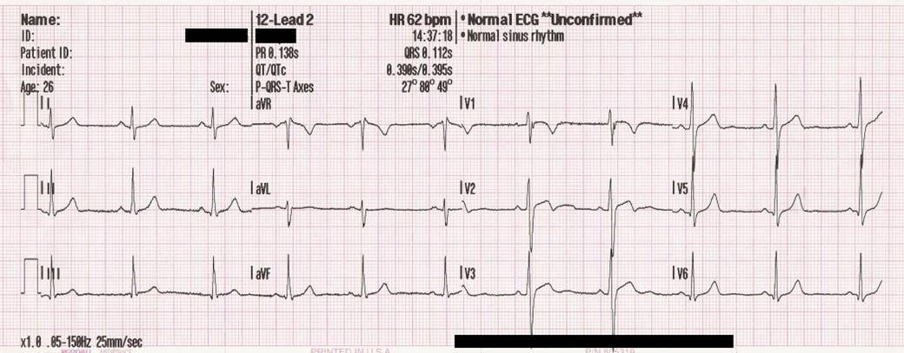
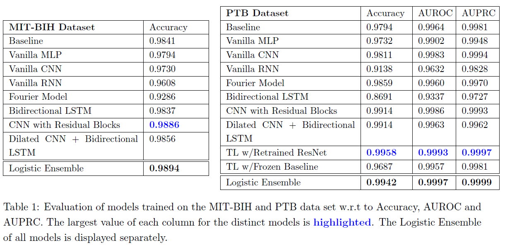

# Arrhythmia Detectron: A Deep Dive into Electrocardiogram (ECG) Signal Classification with RNNs, CNNs and Transfer Learning
This repository contains arrhythmia classification project, particularly ECG signal classification on MIT-BIH (109446 samples belonging 5 different classes) and PTB Diagnostic ECG database (14552 samples belonging 2 classes) ECG datasets.

More information regarding datasets: [the MIT-BIH Arrhythmia Dataset](https://www.physionet.org/content/mitdb/1.0.0/) and [PTB Diagnostic ECG Database.](https://www.physionet.org/content/ptbdb/1.0.0/)

#### Problem Definition

An ECG signal is a 1D signal that is the result of recording the electrical activity of the heart during its cardiac cycles. It forms an electrogram of the heart that is a visual representation of voltage versus time of the electrical activity. ECG is one of fundamental diagnostic tool, along with other medical findings, that the cardiologists utilize to detect heart anomalies and diseases.

Example ECG: **TODO**

<figcaption>
Image source: https://en.wikipedia.org/wiki/Electrocardiography#Diagnosis
</figcaption>

In this project, we solved multi-class classification problem for the MIT-BIH Arrhythmia Dataset and binary classification problem for PTB Diagnostic ECG Database using RNNs, LSTMs, CNNs and Transfer Learning models.

#### Dataset
###### MIT-BIH Arrhythmia Dataset

- Number of Samples: 109.446
- Signal Categories: Normal beat (N), Supraventricular premature beat (S), Premature ventricular contraction (V), Fusion of ventricular and normal beat (F), Unclassifiable beat (Q).

###### The PTB Diagnostic ECG Database

- Number of Samples: 14.552
- Signal Categories: 2 (Normal vs Abnormal)

All samples in the datasets are cropped, downsampled and padded with zeros.

#### Project Steps
1. Solve the classification task for both datasets with Vanilla RNNs and CNNs.
  - For the binary one, report accuracy, AUROC and AUPRC.
  - For the non-binary one, report accuracy.
  - Compare with baseline.
2. Implement additional models such as bidirectional LSTM, CNN with residual blocks, autoencoder, transformers.
3. Ensemble of models (e.g. average of the outputs, logistic regression on the
outputs, etc).
4. Use Transfer Learning for the selected models.

### Respiratory Structure
- `arrhythmia_detectron.ipynb`:A Jupyter notebook that includes code snippets.
- `saved_weights`: The machine learning models' artifacts obtained after project finalization.
- `figures`: The figures and plots.
- `environment_minimal.yml`: An python environment used in this project.

### Results and Discussion

[Detailed project report can be found here.](report/project_report.pdf)

Below tables indicate our model performances compared with the baseline performances.

###### Task 1
According to the model performances depicted in Table below, it is evident that the Baseline model is well-designed and tuned for the tasks at hand, especially for the MIT-BIH dataset. However, the Vanilla models depicted show promising performances without any complex architecture, specifically the Vanilla CNN outperforms the baseline model on the PTB dataset. Therefore, we allocate our focus to design well-tailored and high performing CNN and RNN based approaches to tackle other tasks of the project.

###### Task 2

###### Dilated CNN + Bidirectional LSTM
To improve performance and robustness of Bidirectional LSTM model, we introduced hybrid architecture consisting of Convolutional and Bidirectional LSTM layers. The main idea of this model is to extract and distill the crucial features from the sequences by utilizing 1D Dilated Convolutions and then process the distilled and compressed features by a Bidirectional LSTM for classification. Instead of simply feeding the input sequences to the Bidirectional LSTM units, we benefitted from dilated convolutions to capture longer dependencies (as ECG is time-dependent signal) and useful features. We use a larger kernel field of view, a Maxpooling layer to reduce feature dimension throughout 4 convolutional blocks and Dropout layers to gain robustness. Additionally, we benefited from the Sparse Categorical Focal Loss function, a specially designed loss function that enforces model to learn hard negatives, in our case under represented observations, to combat the class imbalance and tackle the overconfidence problem of the Cross Entropy Loss.

###### Transfer Learning
Transfer Learning is a well-known approach of reusing models trained on a task for another task. Since the two dataset of the project have inputs with the same format and the first dataset has more data, we try to transfer some models from the first dataset to the second dataset. For this task we experimented with two different transfer learning approaches and two different models. For the first approach, we use the baseline model of the MIT-BIH dataset, replace its fully connected layers and only train those on the PTB dataset. For the second approach we use the 398 layer ResNet trained on the MIT-BIH dataset, replace its fully connected layer and retrain the whole model on the PTB dataset. Overall, we observed that Transfer Learning is very effective to further boost model performance.

### Acknowledgements
This project is a collaborative work among Mesut Ceylan, Sven Gregorio and Moritz Vandenhirtz for Machine Learning for Healthcare course in ETH Zürich.

### License
This work is licensed under MIT License, however it is subject to repository-owner approval and permission for public and private usage.
